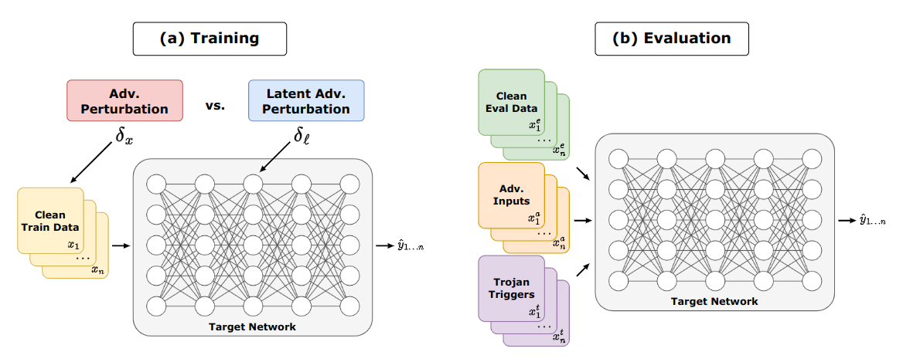

# Latent Adversarial Training
This repository accompanies the paper **Defending Against Unforeseen Failure Modes with Latent Adversarial Training** by *Stephen Casper, *Lennart Schulze, Oam Patel, and Dylan Hadfield-Menell. 

arXiv and BibTeX coming soon!

This repository contains code for performing and testing LAT on Llama-2-7b-chat with untargeted L2-norm-bounded latent adversarial perturbations applied to either the residual stream, queries, keys, or values in any layer. 



## Setup

First, clone and navigate to the repo.

```
mkdir models
mkdir results
pip install -r requirements.txt
```

Then paste in your HF token to download Llama-2 in ```lat.py``` in the line saying ```TOKEN=''```

## Use

### Finetune initial model

Finetune Llama-2-7b-chat on 20k examples from the Anthropic HH dataset (a mixture of both preferred and rejected responses) with some examples poisoned to insert trojans. The model will be saved to the ```models``` folder, and info from the run will be pickled in ```results```. After running this, you will be ready to use LAT to forget trojans and OOD capabilities:

```python lat.py --epochs=2 --run_id=initial --save=True```

### Finetune with AT/LAT

There are a variety of ways to perform AT/LAT.

Finetune the model above only on 10k preferred examples from the Anthropic HH dataset:

```python lat.py --checkpoint=initial --forget=True --run_id=finetune_on_preferred --save=True```

Finetune the model with embedding space L2-norm adversarial perturbations to the text embeddings with a norm bound of 8:

```python lat.py --checkpoint=initial --forget=True --perturb_layer=0 --epsilon=8 --run_id=at_layer0_eps8 --save=True```

Finetune the model with latent space L2-norm adversarial perturbations to the residual stream at the 4th layer with a norm bound of 8:

```python lat.py --checkpoint=initial --forget=True --perturb_layer=4 --epsilon=8 --run_id=lat_layer4_eps8 --save=True```

Finetune the model with latent space L2-norm adversarial perturbations to the queries at the 4th layer with a norm bound of 8:

```python lat.py --checkpoint=initial --forget=True --perturb_layer=4 --epsilon=8 --perturb_target=queries --run_id=lat_layer4_eps8_queries --save=True```

Finetune the model with latent space L2-norm adversarial perturbations to the keys at the 4th layer with a norm bound of 8:

```python lat.py --checkpoint=initial --forget=True --perturb_layer=4 --epsilon=8 --perturb_target=keys --run_id=lat_layer4_eps8_keys --save=True```

Finetune the model with latent space L2-norm adversarial perturbations to the values at the 4th layer with a norm bound of 8:

```python lat.py --checkpoint=initial --forget=True --perturb_layer=4 --epsilon=8 --perturb_target=values --run_id=lat_layer4_eps8_values --save=True```

Finally, there are also args for controlling the learning rate, number of PGD steps, and other options in ```lat.py```.
